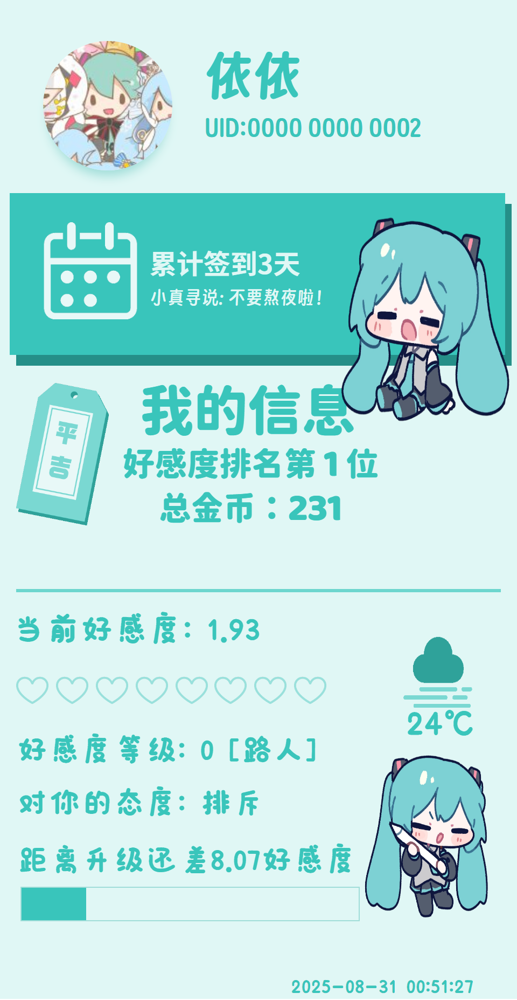

# zhenxun-theme-miku

适用于 zhenxun_bot 的 miku 色系主题

# 使用方法

1. 下载本仓库
2. 将 `miku` 文件夹移动到到 zhenxun_bot 目录的 `/resources/themes/` 文件夹中
3. 对你的 Bot 发送 `ui theme miku` 以启用主题

# 预览

### 签到

### 个人信息

### 帮助

### 单项帮助

### 商店

### 更多内容请自行探索...

# 版权提醒

仓库中的初音未来图片资源均来自 [みらつ/밋다다 @miratsu169](https://x.com/miratsu169), 未经其本人允许, 不可用于商业用途
